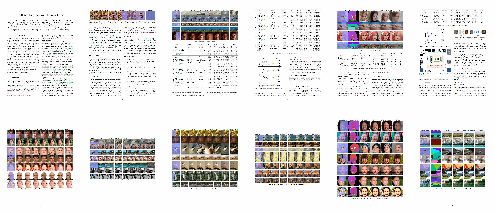
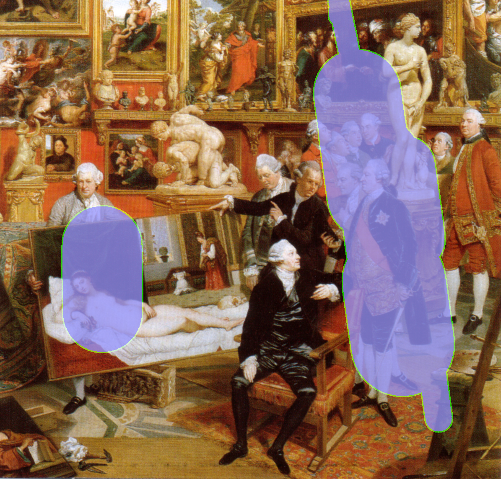
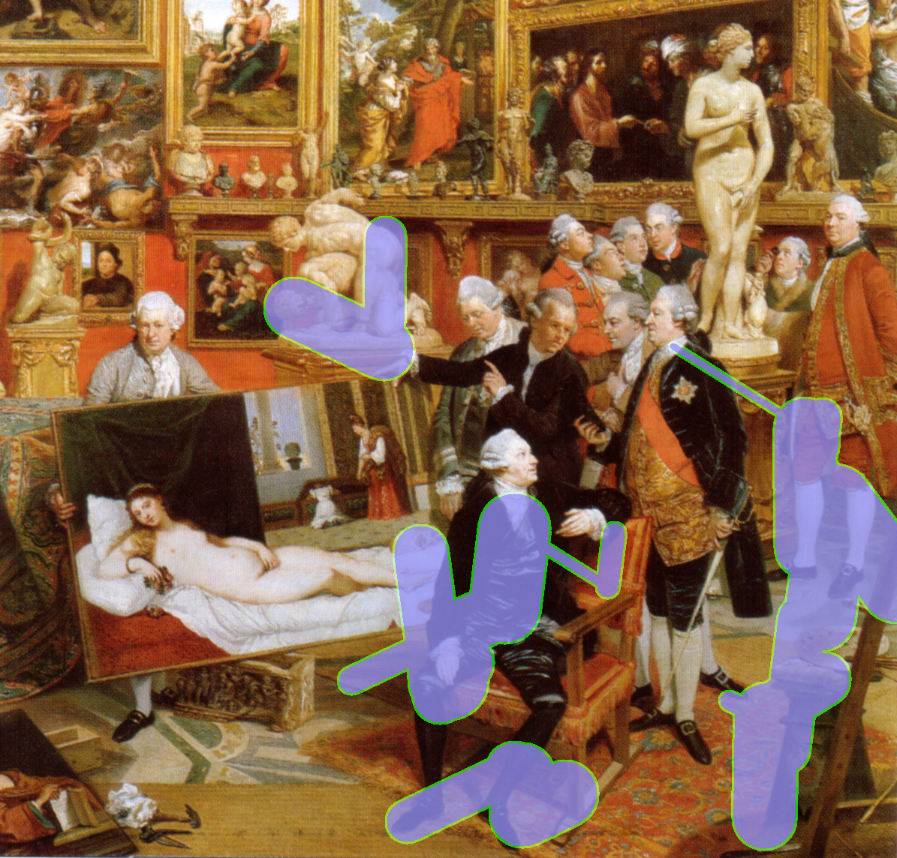
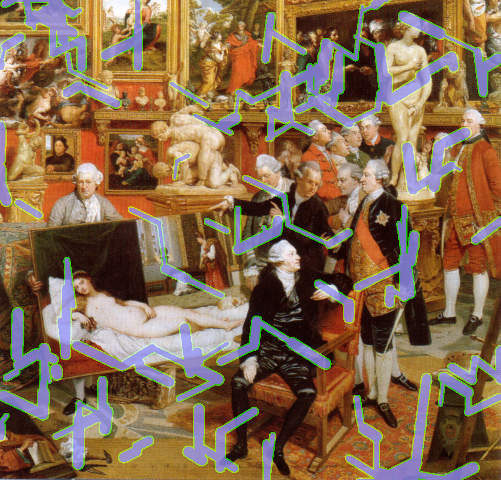
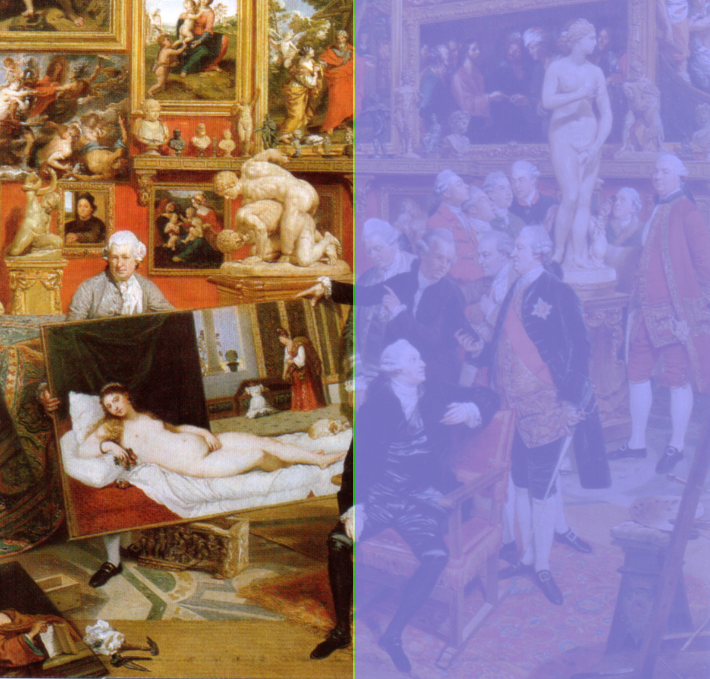
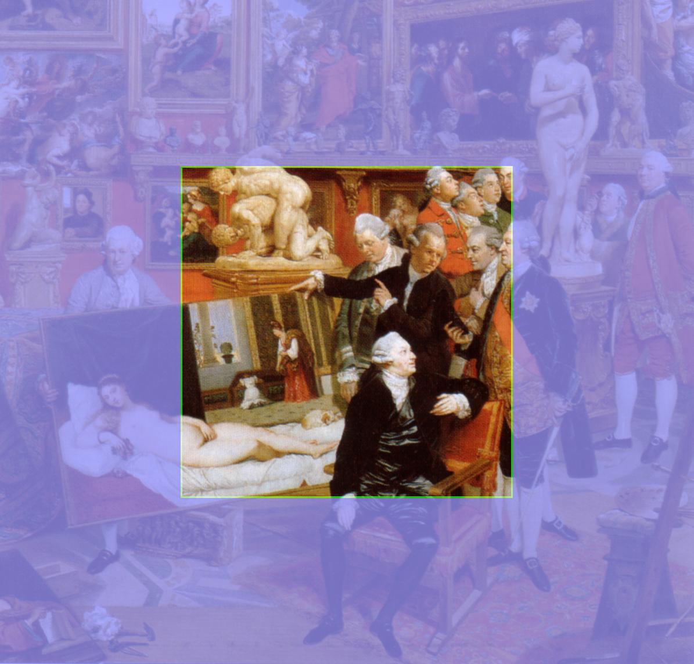

# NTIRE 2022 - Image Inpainting Challenge

[<kbd>  </kbd>](https://polybox.ethz.ch/index.php/s/zR0ghhWkCb8vpsR)

## Important dates
- **2022.02.01**: Release of train data (input and output images) and validation data (only input)
- **2022.02.01**: Validation server online
- **2022.03.23**: Final test data release (only input images)
- **2022.03.30**: Test output results submission deadline
- **2022.03.30**: Fact sheets and code/executable submission deadline
- **2022.04.01**: Preliminary test results release to the participants
- **2022.04.11**: Paper submission deadline for entries from the challenge
- **2022.06.19**: Workshop day

## Description


The 7th edition of [NTIRE: New Trends in Image Restoration and Enhancement workshop will be held on June 2022 in conjunction with CVPR 2022](https://data.vision.ee.ethz.ch/cvl/ntire22/).

Image manipulation is a key computer vision task, aiming at the restoration of degraded image content, the filling in of missing information, or the needed transformation and/or manipulation to achieve the desired target (with respect to perceptual quality, contents, or performance of apps working on such images). Recent years have witnessed an increased interest from the vision and graphics communities in these fundamental topics of research. Not only has there been a constantly growing flow of related papers, but also substantial progress has been achieved.

Recently, there has been a substantial increase in the number of published papers that directly or indirectly address Image Inpainting. Due to a lack of a standardized framework, it is difficult for a new method to perform a comprehensive and fair comparison with respect to existing solutions.
This workshop aims to provide an overview of the new trends and advances in those areas. Moreover, it will offer an opportunity for academic and industrial attendees to interact and explore collaborations.

Jointly with the NTIRE workshop, we have an NTIRE challenge on Image Inpainting, that is, the task of predicting the values of missing pixels in an image so that the completed result looks realistic and coherent. This challenge has 3 main objectives:

1. Direct comparison of recent state-of-the-art Image Inpainting solutions, which will be considered as baselines. See [baselines](baselines/).
2. To perform a comprehensive analysis on the different types of masks, for instance, strokes, half completion, nearest neighbor upsampling, *etc*. Thus, highlighting the pros and cons of each method for each type of mask. See [Type of masks](#type-of-masks).
3. To set a public benchmark on 4 different datasets ([FFHQ](https://github.com/NVlabs/ffhq-dataset), [Places](http://places2.csail.mit.edu), [ImageNet](https://www.image-net.org/challenges/LSVRC/2012/index.php#), and [WikiArt](https://www.kaggle.com/c/painter-by-numbers/data)) for direct and easy comparison. See [data](data/).

This challenge has 2 tracks:
- **Track 1**: [Traditional Image Inpainting](https://codalab.lisn.upsaclay.fr/competitions/1607).
- **Track 2**: [Image Inpainting conditioned on Semantic Segmentation mask](https://codalab.lisn.upsaclay.fr/competitions/1608).


## Main Goal
The aim is to obtain a **mask agnostic** network design/solution capable of producing high-quality results with the best perceptual quality with respect to the ground truth.

## Type of Masks
In addition to the typical strokes, with this challenge, we aim at more generalizable solutions. 


|                  Thick Strokes                 |                  Medium Strokes                |                  Thin Strokes                 |
:-----------------------------------------------:|:----------------------------------------------:|:----------------------------------------------:
|     |    |     |

|                  Every_N_Lines                 |                  Completion                    |                  Expand                       |
:-----------------------------------------------:|:----------------------------------------------:|:----------------------------------------------:
|    |       |          |

|                  Nearest_Neighbor              |
:-----------------------------------------------:|
|     

## Data
Following a common practice in Image Inpainting methods, we use three popular datasets for our challenge: [FFHQ](https://github.com/NVlabs/ffhq-dataset), [Places](http://places2.csail.mit.edu), and [ImageNet](https://www.image-net.org/challenges/LSVRC/2012/index.php#). Additionally, to explore a new benchmark, we also use the [WikiArt](https://www.kaggle.com/c/painter-by-numbers/data) dataset to tackle inpainting towards art creation. See the [data](data/) for more info about downloading the datasets.

## Competition
The top-ranked participants will be awarded and invited to follow the CVPR submission guide for workshops to describe their solutions and to submit to the associated NTIRE workshop at CVPR 2022.

## Evaluation
See [Evaluation](evaluation).

## Provided Resources
- Scripts: With the dataset, the organizers will provide scripts to facilitate the reproducibility of the images and performance evaluation results after the validation server is online. More information is provided on the data page.
- Contact: You can use the forum on the data description page ([Track1](https://codalab.lisn.upsaclay.fr/competitions/1607) and [Track 2](https://codalab.lisn.upsaclay.fr/competitions/1608) - highly recommended!) or directly contact the challenge organizers by email (me [at] afromero.co, a.castillo13 [at] uniandes.edu.co, and Radu.Timofte [at] vision.ee.ethz.ch) if you have doubts or any question.

## Issues and questions: 
In case of any questions about the challenge or the toolkit, feel free to open an issue on Github.

## Organizers
* [Andrés Romero](https://afromero.co) (roandres@ethz.ch)
* [Ángela Castillo](https://angelacast135.github.io/) (a.castillo13@uniandes.edu.co)
* [Radu Timofte](http://people.ee.ethz.ch/~timofter/) (radu.timofte@vision.ee.ethz.ch)

## Terms and conditions
The terms and conditions for participating in the challenge are provided [here](terms_and_conditions.md)

## Shout-outs
Thanks to everyone who makes their code and models available. In particular,

- The [MMSegmentation](https://github.com/open-mmlab/mmsegmentation) framework, from which we use DeepLabV3 to annotate the Places dataset
- All the authors in [baselines](baselines/) for providing their code and pre-trained models for easy comparison
- The authors of [LaMa](https://github.com/saic-mdal/lama) for providing the scripts for the stroke masks
- [@andreas128](https://github.com/andreas128) for providing the mask generation scripts and visualizations
- The authors of [ FFHQ-Aging-Dataset
Public](https://github.com/royorel/FFHQ-Aging-Dataset) for providing a nice testbed for a FFHQ face parsing annotation
- The good [Learned Perceptual Similarity (LPIPS)](https://github.com/richzhang/PerceptualSimilarity)

## Bibtex
```
@inproceedings{romero2022ntire,
  title={NTIRE 2022 image inpainting challenge: Report},
  author={Romero, Andres and Castillo, Angela and Abril-Nova, Jose and Timofte, Radu and Das, Ritwik and Hira, Sanchit and Pan, Zhihong and Zhang, Min and Li, Baopu and He, Dongliang and others},
  booktitle={Proceedings of the IEEE/CVF Conference on Computer Vision and Pattern Recognition},
  pages={1150--1182},
  year={2022}
}
```
